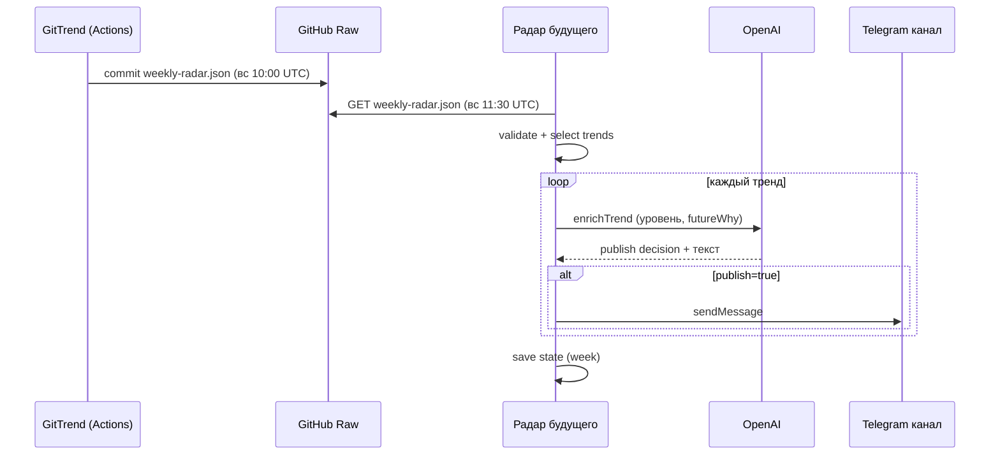

# ТЗ: проект «Радар будущего» — интеграция с GitTrend

> **Для кого:** разработчик / AI-ассистент проекта «Радар будущего».  
> **Статус GitTrend (источник):** реализовано, опубликовано в https://github.com/zobnin8-ux/gitrend  
> **Дата:** 2026-06-09

---

## 1. Контекст и разделение ответственности

| Система | Вопрос | Не делает |
|---------|--------|-----------|
| **GitTrend** | Что **сейчас** быстро набирает популярность среди **разработчиков на GitHub**? | Telegram, уровни радара, «влияние на мир», посты |
| **Радар будущего** | **Почему** это может быть важно для будущего? Публиковать ли в канал? Какой уровень? | Сбор GitHub-данных, детекция сырых трендов |

GitTrend — **датчик**. Радар будущего — **интерпретатор и издатель**.

---

## 2. Что уже сделано в GitTrend (не трогать)

### 2.1. Еженедельный JSON-отчёт

**Файл в репозитории:**

```text
reports/weekly-radar.json
```

**Публичный Raw URL (основная точка интеграции):**

```text
https://raw.githubusercontent.com/zobnin8-ux/gitrend/main/reports/weekly-radar.json
```

Альтернатива — GitHub API Contents (нужен token только при приватном репо; репозиторий публичный):

```text
GET https://api.github.com/repos/zobnin8-ux/gitrend/contents/reports/weekly-radar.json
```

### 2.2. Расписание обновления GitTrend

- **GitHub Actions:** `.github/workflows/weekly-radar.yml`
- **Cron:** воскресенье, **10:00 UTC**
- **Шаги:** `npm run radar:refresh` → `npm run radar:weekly` → commit + push `weekly-radar.json`
- **Локально:** `npm run radar:weekly`, `npm run radar:weekly -- --commit --push`

### 2.3. Модуль генерации (GitTrend)

```text
src/radar/
  generateWeeklyRadar.ts   — детекция 1–3 трендов, запись JSON
  categories.ts            — категории (ai-agents, mcp, …)
  commitReport.ts          — git commit
  types.ts                 — TypeScript-типы контракта
scripts/weekly-radar.ts    — CLI
```

### 2.4. Логика отбора трендов (GitTrend)

В отчёт попадают **тренды**, не отдельные репозитории:

- ≥2 репозитория в **одной категории**
- устойчивый **недельный** рост (`growth_7d`, снапшоты ≥2 дней)
- активность (`pushed_at` ≤ 14 дней)
- рост **не сосредоточен** в одном репо (доля топ-репо ≤ 72%)
- категория `other` **не включается**
- максимум **3** тренда; если нет достойных — `"trends": []`

GitTrend **не** генерирует текст для Telegram и **не** присваивает уровни радара.

---

## 3. Контракт данных `weekly-radar.json`

### 3.1. Корневая структура

```json
{
  "week": "2026-W24",
  "generatedAt": "2026-06-09T20:52:29.515Z",
  "trends": [ /* 0–3 элемента */ ]
}
```

| Поле | Тип | Описание |
|------|-----|----------|
| `week` | string | ISO-неделя `YYYY-Www` |
| `generatedAt` | string | ISO 8601 UTC, момент генерации |
| `trends` | array | 0–3 тренда |

### 3.2. Объект тренда

```json
{
  "title": "Рост AI-агентов для разработки",
  "summary": "…",
  "whyTrending": "…",
  "category": "ai-agents",
  "signalStrength": "high",
  "repos": [
    {
      "name": "hermes-agent",
      "url": "https://github.com/…",
      "stars": 188546,
      "starsDelta": 9202
    }
  ]
}
```

| Поле | Тип | Значения |
|------|-----|----------|
| `title` | string | Краткое название тренда (RU) |
| `summary` | string | 1–2 предложения (RU) |
| `whyTrending` | string | Почему это тренд на GitHub (RU), не «прогноз будущего» |
| `category` | enum | см. §3.3 |
| `signalStrength` | enum | `high` \| `medium` \| `low` |
| `repos` | array | 2–5 репозиториев-доказательств |

### 3.3. Категории (`category`)

```text
ai-agents | developer-tools | mcp | automation | robotics
computer-vision | voice-ai | llm | infrastructure | security
data | productivity | other
```

(`other` в GitTrend не публикуется, но enum зарезервирован.)

### 3.4. Пустой отчёт — норма

```json
{
  "week": "2026-W25",
  "generatedAt": "…",
  "trends": []
}
```

Радар будущего **не обязан** публиковать пост. Тихий skip — корректное поведение.

### 3.5. TypeScript-типы (скопировать в проект Радара)

См. `src/radar/types.ts` в репозитории GitTrend — можно вынести в общий пакет или скопировать интерфейсы `WeeklyRadarReport`, `WeeklyRadarTrend`, `WeeklyRadarRepo`.

---

## 4. ТЗ: что реализовать в проекте «Радар будущего»

### 4.1. Цель

Автономный сервис/скрипт, который:

1. Раз в неделю **после** обновления GitTrend забирает `weekly-radar.json`.
2. Валидирует JSON по контракту.
3. Для каждого тренда (или для отобранных) решает: **публиковать / пропустить / отложить**.
4. Формирует **пост для Telegram-канала** «Радар будущего» (уровень, нарратив, последствия — **только здесь**).
5. Публикует в канал через Bot API (или ставит в очередь модерации).

GitTrend **не участвует** в шагах 3–5.

---

### 4.2. Рекомендуемая архитектура

```text
radar-future/                    # отдельный репозиторий / проект
  src/
    ingest/
      fetchWeeklyRadar.ts        # HTTP GET Raw URL
      validateReport.ts          # JSON Schema / Zod
    pipeline/
      processWeeklyReport.ts     # оркестрация
      selectTrendsForPublish.ts  # фильтр + дедуп по week
    intelligence/
      enrichTrend.ts             # OpenAI: уровень, «почему важно для будущего»
      buildTelegramPost.ts       # финальный текст поста
    publish/
      telegramBot.ts             # sendMessage / sendPhoto
    storage/
      state.db | state.json      # уже обработанные week + trend id
  config/
    .env.example
  .github/workflows/
    weekly-publish.yml           # cron после GitTrend
```

---

### 4.3. Модуль `fetchWeeklyRadar`

**Задача:** скачать актуальный отчёт.

```typescript
const RADAR_JSON_URL =
  process.env.GITTREND_RADAR_URL ??
  "https://raw.githubusercontent.com/zobnin8-ux/gitrend/main/reports/weekly-radar.json";

async function fetchWeeklyRadar(): Promise<WeeklyRadarReport> {
  const res = await fetch(RADAR_JSON_URL, { cache: "no-store" });
  if (!res.ok) throw new Error(`GitTrend radar fetch failed: ${res.status}`);
  return res.json();
}
```

**Рекомендации:**

- Сохранять `ETag` / `Last-Modified` или хеш файла — не обрабатывать дважды одну неделю.
- Retry 3× с backoff (GitHub Actions GitTrend может закончить на несколько минут позже 10:00 UTC).

---

### 4.4. Модуль `validateReport`

**Задача:** отклонить битый JSON до LLM/Telegram.

Проверки:

- обязательные поля `week`, `generatedAt`, `trends`
- `week` matches `/^\d{4}-W\d{2}$/`
- `trends.length` ≤ 3
- у каждого тренда: `title`, `summary`, `whyTrending`, `category`, `signalStrength`, `repos.length` ≥ 2
- `repos[].url` — валидный GitHub URL

При ошибке валидации — алерт админу (Telegram личка / лог), **не** пост в канал.

---

### 4.5. Модуль `selectTrendsForPublish`

**Задача:** решить, что идёт в канал.

Вход: `WeeklyRadarReport`  
Выход: `0–N` трендов для публикации

**Минимальные правила (настраиваемые):**

| Правило | По умолчанию |
|---------|--------------|
| Пропустить, если `trends` пуст | да |
| Не публиковать повторно ту же `week` | да (state) |
| Минимальный `signalStrength` | `medium` (опционально) |
| Макс. постов за неделю | 1–3 |
| Cooldown по `category` | не чаще 1 раза в 2 недели на категорию |

**Idempotency key:** `week + category + title` → запись в state.

---

### 4.6. Модуль `enrichTrend` (OpenAI — только Радар будущего)

**Задача:** превратить GitHub-тренд в «сигнал будущего».

**Вход:** объект `WeeklyRadarTrend` + метаданные недели  
**Выход:** структура для поста, например:

```json
{
  "radarLevel": 1,
  "headline": "…",
  "futureWhy": "…",
  "whoShouldCare": "…",
  "watchSignals": ["…"],
  "publish": true,
  "skipReason": null
}
```

**Промпт (принципы):**

- Использовать **только** факты из `summary`, `whyTrending`, `repos`.
- **Не выдумывать** репозитории и цифры.
- `futureWhy` — гипотеза о значимости, помечать как интерпретацию.
- Можно вернуть `"publish": false` с `skipReason` (слабый сигнал, повтор, hype).

GitTrend-поля `whyTrending` ≠ `futureWhy`: первое — про GitHub, второе — про Рadar.

---

### 4.7. Модуль `buildTelegramPost`

**Задача:** HTML/Markdown для Telegram.

**Шаблон (черновик):**

```text
🔮 Радар будущего · {week}
Уровень: {radarLevel}/5

{headline}

📈 GitHub-сигнал
{summary из GitTrend}

🔭 Почему это может быть важно
{futureWhy}

🔗 Репозитории
• {name} (+{starsDelta}) — {url}

#радарбудущего #{category}
```

Оформление, эмодзи, лимит 4096 символов — ответственность Радара.

---

### 4.8. Модуль `telegramBot`

**Env:**

```env
TELEGRAM_BOT_TOKEN=…
TELEGRAM_CHANNEL_ID=@your_channel_or_-100…
GITTREND_RADAR_URL=https://raw.githubusercontent.com/zobnin8-ux/gitrend/main/reports/weekly-radar.json
OPENAI_API_KEY=…
```

**Публикация:**

```typescript
await bot.sendMessage(TELEGRAM_CHANNEL_ID, text, {
  parse_mode: "HTML",
  disable_web_page_preview: false,
});
```

**Безопасность:**

- токен бота только в secrets / `.env.local`
- бот добавлен в канал как **администратор** с правом post messages

**Опционально:** режим `DRY_RUN=true` — писать пост в лог / админ-чат без публикации.

---

### 4.9. Расписание (GitHub Actions Радара будущего)

Запуск **после** GitTrend (буфер 30–60 мин):

```yaml
on:
  schedule:
    - cron: "30 11 * * 0"   # воскресенье 11:30 UTC
  workflow_dispatch:
```

**Шаги:**

1. `fetchWeeklyRadar`
2. `validateReport`
3. если `trends.length === 0` → exit 0, log «нет трендов»
4. `selectTrendsForPublish`
5. для каждого: `enrichTrend` → если `publish` → `buildTelegramPost` → `telegramBot.send`
6. сохранить state

**Альтернатива:** cron на VPS / Windows Task Scheduler + один бинарник `npm run radar:publish`.

---

### 4.10. Обработка ошибок

| Ситуация | Поведение |
|----------|-----------|
| GitTrend JSON недоступен | retry, затем alert админу |
| `trends: []` | тихий exit, без поста |
| OpenAI недоступен | alert, не публиковать сырые данные без enrich (или fallback «только GitHub-сигнал» — решение продукта) |
| Telegram 429 | backoff |
| Тренд уже обработан (`week` в state) | skip |

---

### 4.11. Что НЕ делать в Радаре будущего

- ❌ Не дублировать логику GitTrend (скрейп GitHub, snapshots, growth)
- ❌ Не требовать изменений в GitTrend для Telegram
- ❌ Не публиковать «топ репо по звёздам» без слоя enrich
- ❌ Не коммитить в репозиторий GitTrend

---

## 5. Схема потока данных



---

## 6. Критерии приёмки (Радар будущего)

- [ ] Сервис стабильно скачивает JSON по Raw URL
- [ ] Валидация отклоняет битый JSON
- [ ] Пустой `trends: []` не вызывает пост
- [ ] Одна и та же `week` не публикуется дважды
- [ ] Пост содержит: уровень радара, GitHub-сигнал, интерпретацию «для будущего», ссылки на repos
- [ ] GitTrend не модифицируется
- [ ] `DRY_RUN` для тестов без спама в канал
- [ ] Secrets: `TELEGRAM_BOT_TOKEN`, `OPENAI_API_KEY` (опционально `GITTREND_RADAR_URL`)

---

## 7. Чеклист первого запуска (ручной)

1. Убедиться, что Raw URL открывается в браузере и JSON валиден.
2. Создать бота через [@BotFather](https://t.me/BotFather), добавить в канал «Радар будущего» как admin.
3. Реализовать `fetch` + `validate` + вывод в консоль.
4. `DRY_RUN=true` — прогнать enrich + шаблон поста.
5. Один тестовый пост в **приватный** канал / личку.
6. Включить cron Actions или Task Scheduler.

---

## 8. Ссылки

| Ресурс | URL |
|--------|-----|
| Репозиторий GitTrend | https://github.com/zobnin8-ux/gitrend |
| Raw JSON | https://raw.githubusercontent.com/zobnin8-ux/gitrend/main/reports/weekly-radar.json |
| Workflow GitTrend | https://github.com/zobnin8-ux/gitrend/blob/main/.github/workflows/weekly-radar.yml |
| Типы | https://github.com/zobnin8-ux/gitrend/blob/main/src/radar/types.ts |

---

## 9. Возможные расширения (не в scope v1)

- Webhook от GitTrend → Радар (вместо polling по cron)
- Общий npm-пакет `@zobnin/radar-contract` с типами
- RSS/Atom feed поверх JSON
- Админ-UI для approve перед постом
- Несколько языков постов

---

*Документ описывает границу между GitTrend и «Радаром будущего». Изменения контракта JSON — только через PR в GitTrend с обновлением этого файла.*
