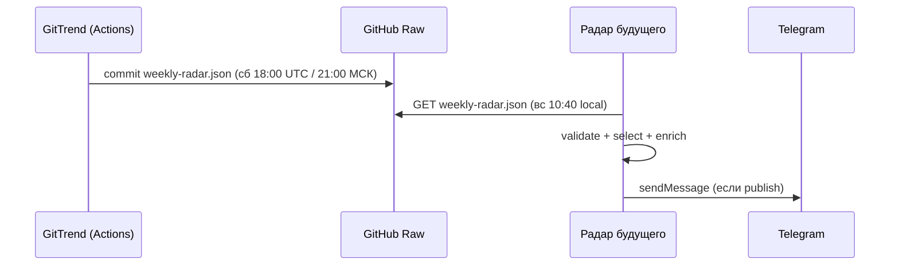

# Обновление расписания: GitTrend → «Радар будущего»

> **Для кого:** разработчик / AI-ассистент проекта «Радар будущего».  
> **Тип:** событие-обновление (изменение cron, контракт данных без изменений).  
> **Дата:** 2026-06-14  
> **Полное ТЗ интеграции:** [RADAR-FUTURE-INTEGRATION-TZ.md](./RADAR-FUTURE-INTEGRATION-TZ.md)

---

## Контекст

**GitTrend** — источник сырых GitHub-трендов.  
**Радар будущего** — потребитель JSON, enrich через OpenAI, публикация в Telegram.

Контракт `weekly-radar.json` **не менялся**. Меняется только **время публикации** файла на GitHub.

---

## Что изменилось (событие)

| Было | Стало |
|------|--------|
| GitTrend публиковал JSON **воскресенье 10:00 UTC** | **Суббота 18:00 UTC** (= **21:00 МСК**) |
| Радар забирал ~11:30 UTC | Радар: **вс 10:40** GitTrend, **вс 11:20** направление (локально) |

**Домашняя сетка минут** (`src/utils/cronSchedule.ts`):

| Задача | Cron |
|--------|------|
| Publish | `5 */2 * * *` |
| RSS | `15 */6 * * *` |
| Коробка ср/сб | `25 10 * * 3,6` |
| GitTrend вс | `40 10 * * 0` |
| Направление вс | `20 11 * * 0` |

**Зачем:** к воскресенью утром файл уже лежит на GitHub — Радар успевает обработать и опубликовать в канал.

**Workflow GitTrend:** `.github/workflows/weekly-radar.yml`  
**Cron GitTrend:** `0 18 * * 6`

---

## Источник данных (без изменений)

```text
GET https://raw.githubusercontent.com/zobnin8-ux/gitrend/main/reports/weekly-radar.json
```

Корневая структура:

```json
{
  "week": "2026-W24",
  "generatedAt": "2026-06-09T20:52:29.515Z",
  "trends": []
}
```

- `trends` — массив из **0–3** элементов  
- Пустой `trends: []` — **не ошибка**, пост в канал **не делать**

---

## Расписание Радара (реализовать)

```yaml
# .github/workflows/radar-publish.yml (или cron на VPS)
on:
  schedule:
    - cron: "0 7 * * 0"   # воскресенье 07:00 UTC = 10:00 МСК (на VPS)
```

В домашней версии (Windows): см. `src/utils/cronSchedule.ts` — publish `:05`, RSS `:15`, GitTrend **10:40**, направление **11:20**.

| Параметр | Значение |
|----------|----------|
| Буфер после GitTrend | ~10 часов — достаточно |
| Retry при fetch | 3× с backoff (GitTrend может закончить на 5–15 мин позже) |
| Idempotency | Не обрабатывать дважды одну `week` (state: `week` + hash JSON) |

---

## Пайплайн Радара (логика без изменений)

1. `fetchWeeklyRadar()` — raw URL, `cache: "no-store"`
2. `validateReport()` — схема, `week` matches `/^\d{4}-W\d{2}$/`
3. если `trends.length === 0` → exit 0, log «тихая неделя»
4. `selectTrendsForPublish()` — фильтр по `signalStrength`, cooldown категорий
5. `enrichTrend()` — OpenAI: уровень радара, «почему это будущее», текст поста
6. `telegram.send` — если `publish: true`
7. сохранить state

---

## Timeline (одна строка)

```text
Сб 21:00 МСК  →  GitTrend push JSON
       ↓
Вс 10:40 МСК  →  GitTrend
Вс 11:20 МСК  →  Направление недели
```



---

## Что НЕ делать

- ❌ Не ждать JSON в субботу **до 21:00 МСК** — его ещё нет
- ❌ Не дублировать сбор GitHub / snapshots — это зона GitTrend
- ❌ Не менять URL и формат JSON без согласования с GitTrend
- ❌ Не публиковать сырые данные без слоя `enrichTrend`

---

## Ручной fallback

Если cron пропустил неделю:

1. **GitTrend:** GitHub → Actions → **Weekly Radar Report** → Run workflow  
2. **Радар:** свой `workflow_dispatch` после появления JSON на raw URL

Локально в GitTrend (не для Радара): кнопка **«Опубликовать на GitHub»** на `/insights`.

---

## Переменные окружения (Радар)

```env
GITTREND_RADAR_URL=https://raw.githubusercontent.com/zobnin8-ux/gitrend/main/reports/weekly-radar.json
OPENAI_API_KEY=
TELEGRAM_BOT_TOKEN=
TELEGRAM_CHANNEL_ID=
DRY_RUN=false
```

---

## Чеклист при старте / обновлении Радара

- [ ] Cron-сетка из `cronSchedule.ts` — publish/RSS/рубрики на разных минутах
- [ ] State по `week` — без дублей постов
- [ ] Пустой `trends` — без поста, без алерта
- [ ] Retry fetch с backoff
- [ ] Прочитан полный контракт: [RADAR-FUTURE-INTEGRATION-TZ.md](./RADAR-FUTURE-INTEGRATION-TZ.md)

---

## Ссылки

| Ресурс | URL |
|--------|-----|
| Raw JSON | https://raw.githubusercontent.com/zobnin8-ux/gitrend/main/reports/weekly-radar.json |
| Workflow GitTrend | https://github.com/zobnin8-ux/gitrend/blob/main/.github/workflows/weekly-radar.yml |
| Репозиторий GitTrend | https://github.com/zobnin8-ux/gitrend |
