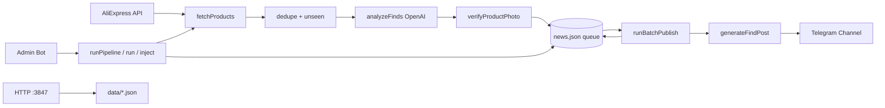

# Китайские штучки — Telegram-бот находок с AliExpress

Автоматический Telegram-канал про **необычные и технологичные** покупаемые гаджеты с AliExpress: фото, цена, партнёрская ссылка «Купить». Не новости, не RSS, не Kickstarter.

| | |
|---|---|
| **Репозиторий** | [zobnin8-ux/radar](https://github.com/zobnin8-ux/radar) |
| **Стек** | TypeScript, Node.js 22+, OpenAI API, Telegram Bot API, AliExpress Affiliate API, node-cron |
| **Панель** | `http://127.0.0.1:3847` (пароль: `DASHBOARD_PASSWORD`) |
| **Промпты** | [docs/PROMPTS.md](docs/PROMPTS.md) |
| **Obsidian** | [docs/obsidian/Китайские штучки.md](docs/obsidian/Китайские%20штучки.md) |

---

## Содержание

1. [Концепция](#1-концепция)
2. [Архитектура](#2-архитектура)
3. [Пайплайн сбора](#3-пайплайн-сбора)
4. [Модель отбора (4 балла)](#4-модель-отбора-4-балла)
5. [AliExpress — источник](#5-aliexpress--источник)
6. [Очередь и публикация](#6-очередь-и-публикация)
7. [Формат поста](#7-формат-поста)
8. [Telegram-команды](#8-telegram-команды)
9. [Расписание (cron)](#9-расписание-cron)
10. [Конфигурация (.env)](#10-конфигурация-env)
11. [Данные (`data/`)](#11-данные-data)
12. [Структура проекта](#12-структура-проекта)
13. [Запуск и разработка](#13-запуск-и-разработка)
14. [Скрипты](#14-скрипты)
15. [Диагностика](#15-диагностика)
16. [Legacy-код](#16-legacy-код)
17. [Связанные документы](#17-связанные-документы)

---

## 1. Концепция

**Вопрос канала:** «Остановится ли человек на 3 секунды и скажет: что это за штука / прикольно?»

**Приоритет контента (доп-ТЗ):**
- Электроника, умные и технологичные гаджеты: VR/AR, smart ring, проекторы, дроны, переводчики, сенсоры, e-ink, мини-роботы.
- **Цена не главное** — дешёвое, но технологичное, проходит.
- Пластиковые гэг-игрушки — редко, только `#Weird` (≤1 на батч).

**Не публикуем:** транспорт целиком, одежду/косметику, скучную бытовуху (карабины, органайзеры, базовые датчики), рекламный мусор на фото.

**Объём:** `MAX_POSTS_PER_DAY=16` — **потолок, не цель**. Публикуем только товары с `finalScore ≥ FIND_MIN_SCORE` (24). Тихий день с 4–6 постами — норма.

---

## 2. Архитектура



| Компонент | Роль |
|-----------|------|
| `src/sources/aliexpress.ts` | Поиск товаров, подпись TOP API, фильтр мусора |
| `src/pipeline/runPipeline.ts` | Сбор → AI → vision → очередь |
| `src/pipeline/runBatchPublish.ts` | Батч-публикация из очереди |
| `src/telegram/adminBot.ts` | Команды админа, прогресс в Telegram |
| `src/dashboard/server.ts` | Веб-панель мониторинга |
| `src/storage/*.ts` | JSON-хранилища в `data/` |

Один процесс Node.js: cron + long polling Telegram + HTTP dashboard.

---

## 3. Пайплайн сбора

`runPipeline()` (`src/pipeline/runPipeline.ts`):

1. **fetchProducts()** — только AliExpress → `NewsItem[]`
2. **dedupeNews** — по `product_id` (стабильный ключ URL)
3. **isSeenUrl** — пропуск уже известных/опубликованных
4. **contentPolicy** + **prefilterNews**
5. **analyzeFinds** — до 45 новых товаров, батчи по 15
6. **selectCleanProductImage** — vision на каждый принятый товар
7. **queueFind** — запись в `data/news.json`

Сбор по cron: `POST_INTERVAL_CRON` (по умолчанию `:30` каждые 4 часа).  
При старте бота — один автоматический сбор (если не `RADAR_SKIP_INITIAL_PIPELINE=1`).

---

## 4. Модель отбора (4 балла)

| Балл | Смысл | Шкала |
|------|--------|-------|
| `curiosity` | «Что это?» | 0–10 |
| `wow` | Необычность / технологичность | 0–10 |
| `share` | Хочется переслать | 0–10 |
| `buy` | Импульс купить | 0–10 |

**finalScore** = сумма (0–40). Порог: **`FIND_MIN_SCORE=24`** (env).

Промпт: эмоция-гейт, BORING_FILTER, блок «ТЕХНОЛОГИЧНОСТЬ», жёсткий отказ транспорта/одежды/цены > $400.  
Полный текст: [docs/PROMPTS.md](docs/PROMPTS.md#1-отбор-товаров--analyzefinds).

Категории (`Category`): `smart-home`, `gadgets`, `edc`, `workshop`, `auto`, `travel`, `desk-setup`, `future-stuff`, `weird`.

---

## 5. AliExpress — источник

**Единственный** активный источник. Без ключей API пайплайн не падает — возвращает пустой список.

### Ключи (.env)

```env
ALIEXPRESS_APP_KEY=537716
ALIEXPRESS_APP_SECRET=<секрет>
ALIEXPRESS_TRACKING_ID=default
```

### Три трека поиска

| Трек | Ключи | Сортировка |
|------|-------|------------|
| **wow** (тех) | `smart glasses`, `VR headset`, `mini projector`, `AI gadget`, `mini drone`, … (18 шт.) | не по объёму продаж |
| **weird** | `weird gadget`, `unusual gadget` | novelty, мало |
| **practical** | `gadget`, `smart home`, `EDC`, `car accessory`, `desk setup` | по популярности |

### Фильтр адаптера

- Чёрный список категорий/заголовков (одежда, косметика, промокоды в title).
- **Нет** hard-gate по `orders` — диковинки с малыми продажами доходят до AI.
- `promotion_link` → `buyUrl` (обязательно партнёрская ссылка).
- Дедуп по `product_id`.

### Фото (§3.7)

Галерея `product_small_image_urls` → vision → чистый кадр. Подробности в [PROMPTS.md](docs/PROMPTS.md#3-проверка-фото--verifyproductphoto).

---

## 6. Очередь и публикация

### Очередь (`data/news.json`)

- Только `status: queued` и `finalScore ≥ FIND_MIN_SCORE`.
- TTL: `FIND_TTL_DAYS` (10), штраф за возраст в `queueScore.ts`.
- Макс. размер: `MAX_PUBLICATION_QUEUE_SIZE=50`.
- Dedup URL по **ID товара** (`ae:100500…`), не по affiliate-параметрам.

### Публикация

| Механизм | Файл | Поведение |
|----------|------|-----------|
| **Батч** | `runBatchPublish.ts` | `min(BATCH_SIZE, очередь, потолок дня)` |
| **/run** | adminBot | То же, до `MAX_POSTS_PER_RUN` |
| **/inject N** | `runQueueInjection.ts` | Ручная публикация, уважает потолок дня |

**Кап #Weird:** максимум **1** пост `category=weird` на батч (`src/utils/queuePick.ts`).

Пауза между постами: **5 секунд**.

Повторная публикация одного `product_id` блокируется (`isAlreadyPublished`).

---

## 7. Формат поста

Генерация: `generateFindPost.ts` → HTML для Telegram (`parseMode: HTML`, фото + текст отдельно).

```
<b>{заголовок с эмодзи}</b>

{что это}

{почему интересно — 2–4 предложения}

💰 $12.90
🛒 Купить на AliExpress  ← кликабельная promotion_link

#Gadgets
```

- Видимый текст: **300–900** символов; длинные обрезаются, не skip.
- Запрещённые рекламные фразы — в промпте.

---

## 8. Telegram-команды

Только для `TELEGRAM_ADMIN_USER_ID`.

| Команда | Действие |
|---------|----------|
| `/status` | Состояние, прогресс, потолок постов, очередь |
| `/collect` | Сбор товаров в очередь (pipeline) |
| `/run` | Опубликовать из очереди (до 4) |
| `/inject 3` | Инъекция N постов (1–10) |
| `/dry` | Сбор в dry-run (без канала) |
| `/queue` | Статистика очереди |
| `/queueprune` | Обслуживание очереди (TTL, порог, лимит) |
| `/today` | Что вышло сегодня |
| `/pause` / `/resume` | Пауза cron |
| `/stop` | Остановить процесс |
| `/panel` | Ссылка на dashboard |

---

## 9. Расписание (cron)

| Задача | Cron (по умолчанию) | Описание |
|--------|---------------------|----------|
| Сбор AliExpress | `30 */4 * * *` | Каждые 4 ч в :30 |
| Батч утро | `0 8 * * *` | До 4 постов |
| Батч день | `0 13 * * *` | |
| Батч вечер | `0 18 * * *` | |
| Батч ночь | `0 22 * * *` | |

Настраивается в `data/settings.json` и `.env` (`BATCH_CRON_*`, `POST_INTERVAL_CRON`).

---

## 10. Конфигурация (.env)

Скопируй `.env.example` → `.env`.

### Обязательные

| Переменная | Описание |
|------------|----------|
| `OPENAI_API_KEY` | OpenAI |
| `TELEGRAM_BOT_TOKEN` | Бот админа |
| `TELEGRAM_CHANNEL_ID` | Канал (@channel или -100…) |
| `TELEGRAM_ADMIN_USER_ID` | Твой numeric user id |
| `ALIEXPRESS_APP_SECRET` | Секрет приложения AE |

### Публикация

| Переменная | Default | Смысл |
|------------|---------|--------|
| `MAX_POSTS_PER_DAY` | 16 | Потолок постов в канал/день |
| `MAX_POSTS_PER_RUN` | 4 | Макс. за один `/run` |
| `BATCH_SIZE` | 4 | Размер cron-батча |
| `FIND_MIN_SCORE` | 24 | Порог в очередь (из 40) |
| `FIND_MAX_PRICE_USD` | 400 | Жёсткий потолок цены |
| `FIND_TTL_DAYS` | 10 | TTL карточки в очереди |
| `DRY_RUN` | false | true = без отправки в канал |

### OpenAI

| Переменная | Default |
|------------|---------|
| `OPENAI_ANALYSIS_MODEL` | gpt-4o-mini |
| `OPENAI_POST_MODEL` | gpt-4o |

### Прочее

| Переменная | Default |
|------------|---------|
| `DASHBOARD_PORT` | 3847 |
| `DASHBOARD_PASSWORD` | radar |
| `ALIEXPRESS_USE_HOTPRODUCT` | false |

---

## 11. Данные (`data/`)

| Файл | Содержимое |
|------|------------|
| `news.json` | Все карточки: очередь, опубликованные, архив |
| `published.json` | История публикаций (dedup) |
| `queue-archive.json` | Вытесненные / истёкшие / сброшенные |
| `settings.json` | Cron, dryRun, paused, rssSources |
| `state.json` | lastRun, логи, pipelineRunning |
| `progress.json` | Прогресс для Telegram UI |
| `admin.json` | chat id админа |

Архив старых данных: `data/_legacy_2026-06-09/`.

**Важно:** не коммить `.env` и секреты. `data/*.json` — рабочее состояние бота.

---

## 12. Структура проекта

```
radar/
├── src/
│   ├── index.ts              # Точка входа
│   ├── config.ts             # Zod-валидация env
│   ├── types.ts              # NewsItem, FindRating, Category…
│   ├── sources/
│   │   ├── aliexpress.ts     # AliExpress TOP API
│   │   └── index.ts          # fetchProducts()
│   ├── pipeline/
│   │   ├── runPipeline.ts    # Сбор + очередь
│   │   ├── runBatchPublish.ts
│   │   ├── runQueueInjection.ts
│   │   ├── publishPosts.ts
│   │   └── scheduler.ts      # node-cron
│   ├── ai/
│   │   ├── analyzeFinds.ts   # 4-балльный отбор
│   │   ├── generateFindPost.ts
│   │   └── verifyProductPhoto.ts
│   ├── telegram/
│   │   ├── adminBot.ts
│   │   └── sendPost.ts
│   ├── storage/              # JSON stores
│   ├── dashboard/            # HTTP API + public/
│   └── utils/                # dedupe, queueScore, queuePick…
├── data/                     # Runtime JSON
├── docs/
│   └── PROMPTS.md            # Все промпты
├── scripts/
│   └── collect-and-publish.ts
├── public/                   # Dashboard static
├── .env.example
├── package.json
└── tsconfig.json
```

---

## 13. Запуск и разработка

### Первый запуск

```bash
cd D:\radar
npm install
cp .env.example .env   # заполнить ключи
npm run build
npm start
```

### Режимы

```bash
npm run dev          # tsx, hot reload
npm run dry          # DRY_RUN=true
npm start            # production (dist/)
```

### Перезапуск (Windows)

```powershell
$p = (netstat -ano | findstr :3847 | ForEach-Object { ($_ -split '\s+')[-1] } | Select-Object -First 1)
if ($p) { taskkill /PID $p /F }
npm run build
npm start
```

Пропустить сбор при старте: `$env:RADAR_SKIP_INITIAL_PIPELINE='1'; npm start`

### Сбор + N постов вручную

```bash
npx tsx scripts/collect-and-publish.ts 3
```

---

## 14. Скрипты

| npm script | Описание |
|------------|----------|
| `build` | `tsc` → `dist/` |
| `start` | Production |
| `dev` | Development (tsx) |
| `dry` | Dry-run mode |
| `dashboard:firewall` | Открыть порт панели в firewall |
| `autostart:remove` | Убрать автозапуск Windows |

---

## 15. Диагностика

| Симптом | Что проверить |
|---------|----------------|
| «В очередь: 0» после сбора | Логи `Analyze: N failed JSON schema parse`; порог 24; промпт |
| Повторы одного товара | `published.json` + dedup по product_id |
| Коллажи на фото | Логи `Photo rejected` / `using fallback`; галерея AE |
| «Потолок на сегодня» | `countChannelPostsToday` vs 16 |
| AliExpress пустой | `ALIEXPRESS_APP_SECRET`, IP Whitelist в консоли AE |
| Бот не отвечает | `TELEGRAM_ADMIN_USER_ID`, webhook удалён (long polling) |

Логи: `data/state.json` → `logs[]`, консоль процесса.

Панель: `http://127.0.0.1:3847` — очередь, статус, кнопки run/collect.

---

## 16. Legacy-код

В репозитории остался код канала **«Радар будущего»** (RSS, GitTrend, InTheBox, weekly trends). **Не используется** текущим ботом находок:

- `src/ai/generateTelegramPost.ts`, `analyzeNews.ts`
- `src/gittrend/*`, `runWeekly*.ts`
- `src/rss/fetchNews.ts` (RSS отключён: `settings.json` → `rssSources: []`)

Подробная legacy-документация: [docs/Радар будущего.md](docs/Радар%20будущего.md) (может быть частично устарела).

---

## 17. Связанные документы

| Документ | Описание |
|----------|----------|
| [docs/PROMPTS.md](docs/PROMPTS.md) | Все system/user промпты |
| [docs/obsidian/Китайские штучки.md](docs/obsidian/Китайские%20штучки.md) | Заметка для Obsidian vault |
| [docs/Радар будущего.md](docs/Радар%20будущего.md) | Legacy: RSS-бот (устарело) |
| [TZ-DOP-TECH-PRIORITY.md](TZ-DOP-TECH-PRIORITY.md) | Доп-ТЗ: тех-приоритет |
| `.env.example` | Шаблон переменных |

---

## Лицензия

MIT
