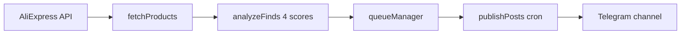

# Китайские штучки

> Telegram-канал **покупаемых** технологичных гаджетов с AliExpress: фото, цена, партнёрская ссылка «Купить». Не RSS, не новости.

**Код:** `D:\radar`  
**GitHub:** [zobnin8-ux/radar](https://github.com/zobnin8-ux/radar)  
**Панель:** http://127.0.0.1:3847  
**README:** `README.md`  
**Промпты:** `docs/PROMPTS.md`

---

## Концепция

**Вопрос канала:** «Остановится ли человек на 3 секунды — что это за штука?»

- Приоритет: электроника, VR/AR, smart ring, проекторы, дроны, e-ink, мини-роботы
- Порог: `finalScore ≥ FIND_MIN_SCORE` (24 из 40)
- `MAX_POSTS_PER_DAY=16` — потолок, не цель; тихий день 4–6 постов — норма

---

## Пайплайн



1. **fetchProducts** — AliExpress TOP API
2. **analyzeFinds** — curiosity / wow / share / buy (0–10 каждый)
3. **Очередь** — только `finalScore ≥ 24`
4. **Публикация** — cron, формат с ценой и «Купить»

---

## Модель отбора (4 балла)

| Балл | Смысл |
|------|-------|
| curiosity | «Что это?» |
| wow | «Вау-эффект» |
| share | «Хочу показать другу» |
| buy | «Хочу купить» |

**finalScore** = сумма (0–40). Порог env: `FIND_MIN_SCORE=24`.

---

## Запуск

```powershell
cd D:\radar
npm install
npm run build
npm start
```

Ярлык: `Radar Future.lnk` / launcher.

---

## Данные

| Файл | Назначение |
|------|------------|
| `data/settings.json` | cron, лимиты, paused |
| `data/queue.json` | очередь публикации |
| `data/state.json` | логи, статус (local, gitignored) |

---

## Legacy

Старый бот **«Радар будущего»** (RSS + GitTrend) — код остался, **не используется** текущим каналом.

Документация legacy: [[Радар будущего]] → `docs/Радар будущего.md`

---

## Связанные проекты

- [[Gitrend]] — weekly GitHub trends / weird finds для старого Radar
- [[LeadRadar]] — мониторинг заказов (`D:\lead\leadradar`)
