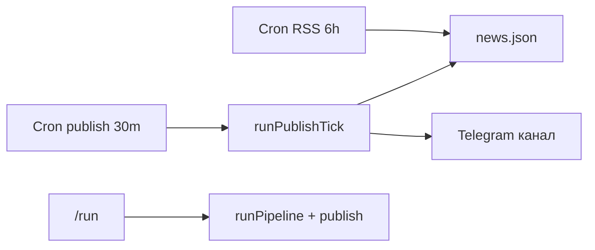
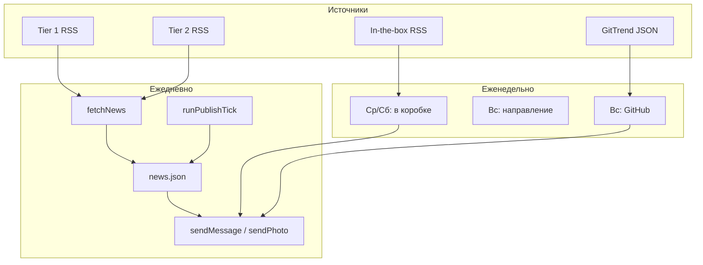

# Радар будущего

> [!summary] Суть
> Домашний бот для Telegram-канала **«Радар будущего»**: RSS → OpenAI → канал. Умная очередь, равномерная публикация, еженедельные рубрики (гаджеты, RSS-тренды, GitHub-сигналы). Управление: веб-панель + команды в личке бота.

**Не новостной агрегатор.** Приоритет: первоисточники, внедрения, слабые сигналы.

---

## Быстрые ссылки

| Что | Где |
| --- | --- |
| Код | `D:\radar` |
| README | [[README]] → `README.md` |
| ТЗ GitTrend | `RADAR-FUTURE-INTEGRATION-TZ.md` |
| Настройки | `data/settings.json` |
| Очередь | `data/news.json` |
| Наблюдения (ур. 1) | `data/observations.json` |
| История канала | `data/published.json` |
| State GitHub | `data/gittrend.json` |
| Гаджеты | `data/in-the-box.json` |
| Отклонения гаджетов | `data/in-the-box-rejections.json` |
| Панель | `http://<IP-ПК>:3847` |
| GitTrend JSON | [weekly-radar.json](https://raw.githubusercontent.com/zobnin8-ux/gitrend/main/reports/weekly-radar.json) |
| GitTrend repo | [gitrend](https://github.com/zobnin8-ux/gitrend) |
| Секреты | `.env` |

---

## Концепция канала

| Уровень | Название | Что происходит |
| --- | --- | --- |
| 1 | Наблюдение | `observations.json`, **не** в канал |
| 2 | Сигнал | Публикуется |
| 3 | Влияние | Публикуется (+ «Сигнал подтвердился») |
| 4 | Прорыв | Публикуется (+ «Сигнал подтвердился») |
| — | Сбой системы | Публикуется |

### Формат поста (основной поток)

Текст + превью ссылки (HTML). **«📡 Наблюдение»** — Observer 2.0 (`generateObserverComment`, gpt-4o при публикации; backfill: `/observer-queue`).

---

## Основной пайплайн и равномерная публикация

> [!important] Два cron
> При `publishEvenSpread: true` (по умолчанию):
> - **`postIntervalCron`** — только RSS + очередь (collect-only)
> - **`publishIntervalCron`** — публикация из очереди по графику

| Параметр | Типичное значение |
| --- | --- |
| `maxPostsPerDay` | 15 |
| `maxPostsPerRun` | 3 |
| `postIntervalCron` | `0 */6 * * *` |
| `publishIntervalCron` | `*/30 * * * *` |

Логика: `postsDueByNow()` — сколько постов «должно» быть к текущему моменту; за тик публикуется `min(отставание, maxPostsPerRun)`.

Файлы: `runPipeline.ts`, `runPublishTick.ts`, `publishFromQueue.ts`, `utils/evenPublish.ts`.



### Умная очередь

- TTL по уровню, `finalScore`, min score, max 50 в очереди
- `/queue`, `/queue-prune`, `/source-stats`
- Архив: `data/queue-archive.json`

---

## Еженедельные рубрики

| Локальное время ПК | Рубрика | Команда | Cron `.env` |
| --- | --- | --- | --- |
| **Ср, Сб** 10:00 | 📦 Будущее в коробке | `/box` | `0 10 * * 3,6` |
| **Вс** 11:00 | 🧭 Направление недели | `/trends` | `0 11 * * 0` |
| **Вс** 11:30 | 🔮 GitHub-сигналы | `/github` | `30 11 * * 0` |

> [!warning] Часовой пояс
> `node-cron` — **локальное время Windows**. МСК ≈ UTC+3, если система на московском времени.

### GitHub-сигналы (GitTrend)

| Кто | Когда | Что |
| --- | --- | --- |
| **GitTrend** (GitHub Actions) | Вс ~10:00 **UTC** | Генерирует `reports/weekly-radar.json` |
| **Radar** | Вс 11:30 **локально** | Скачивает JSON → посты в канал |

Цепочка: `fetchWeeklyRadar` → `validateReport` → `selectTrendsForPublish` → `enrichGitTrend` → `buildGitTrendPost` → `sendPost`.

- 0–3 тренда/неделю, не дневной лимит
- Фильтры: `GITTREND_MIN_SIGNAL_STRENGTH`, кулдаун категории 14 дн., неделя не повторяется (`gittrend.json`)
- Первый пост — анонс (`gitTrendIntro.ts`)
- `/github force` — повтор недели
- **Превью без канала:** `npx tsx scripts/preview-gittrend-admin.ts` (не трогает state)

### Направление недели

3 направления из RSS-сигналов за 7 дней. Отдельно от GitHub.

### Будущее в коробке

> [!note] Визуальная рубрика
> **Устройство + фото устройства** = публикация. Иначе — отклонение в архив.

**Формула допуска:**

```text
boxCandidate === true  AND  hasDeviceImage === true  →  sendPhoto + подпись
```

**Не публикуется:** платформы, реклама, партнёрства, SaaS, логотипы, баннеры, устройство без фото.

**Этапы:**

1. Pre-filter (`gadgetPrefilter.ts`)
2. AI batch (`analyzeGadget.ts`) — `boxCandidate`, `hasDeviceImage`, `deviceName`, …
3. Vision (`verifyDeviceImage.ts`) — финальная проверка картинки
4. Пост (`generateInTheBoxPost.ts`) + **`sendPhoto`** в канал

**Расписание слотов:**

- Cron **среда** и **суббота** — отдельные слоты (неделя не «один раз»)
- Ручной `/box` **не блокирует** cron-слоты

**Отклонения:** `data/in-the-box-rejections.json` (`status: rejected`, причина).

**Маршрутизация:** не-устройства с `interestingForRadar` → основной Radar; **устройство без фото** — только архив.

**Формат поста:**

```text
📦 БУДУЩЕЕ В КОРОБКЕ
[фото устройства]

Заголовок
Что это: …
Что внутри: …
Почему это интересно: …
📡 Наблюдение: …
Источник / Ссылка
```

---

## Архитектура (общая)



### OpenAI-вызовы

| Этап | Файл |
| --- | --- |
| Анализ RSS | `analyzeNews.ts` |
| Текст поста | `generateTelegramPost.ts` |
| Наблюдатель 2.0 | `generateObserverComment.ts` |
| Сигнал подтвердился | `generateSignalConfirmed.ts` |
| Направление недели | `generateWeeklyTrends.ts` |
| GitHub enrich | `enrichGitTrend.ts` |
| Гаджет: отбор | `analyzeGadget.ts` |
| Гаджет: фото | `verifyDeviceImage.ts` |
| Гаджет: пост | `generateInTheBoxPost.ts` |

---

## Пайплайн публикации (детали)

- **Квота категорий** — 4/день
- **Микс горизонтов** — 30%
- **Минимум AI** — 1/день
- **RU-лимит** — 2/день
- **Инъекция** — `/inject N`, `postType: injection`
- **Content firewall** — `contentPolicy.ts`

---

## Настройки

### `data/settings.json`

| Параметр | Значение |
| --- | --- |
| `maxPostsPerDay` | 15 |
| `maxPostsPerRun` | 3 |
| `postIntervalCron` | `0 */6 * * *` |
| `publishEvenSpread` | `true` |
| `publishIntervalCron` | `*/30 * * * *` |
| `categoryQuotaMax` | 4 |
| `horizonMixPercent` | 30 |
| `minAiPostsPerDay` | 1 |

### `.env` — рубрики

```env
WEEKLY_TRENDS_CRON=0 11 * * 0
WEEKLY_GITTREND_CRON=30 11 * * 0
WEEKLY_IN_THE_BOX_CRON=0 10 * * 3,6
GITTREND_RADAR_URL=https://raw.githubusercontent.com/zobnin8-ux/gitrend/main/reports/weekly-radar.json
GITTREND_MAX_POSTS=3
GITTREND_MIN_SIGNAL_STRENGTH=medium
GITTREND_CATEGORY_COOLDOWN_DAYS=14
PUBLISH_INTERVAL_CRON=*/30 * * * *
```

---

## Структура кода

```text
src/pipeline/
  runPipeline.ts          RSS + очередь
  runPublishTick.ts       равномерная публикация
  publishFromQueue.ts
  runWeeklyInTheBox.ts
  runWeeklyGitTrend.ts
  runWeeklyTrends.ts
  routeGadgetToRadar.ts
  scheduler.ts
src/gittrend/
src/ai/                   analyzeGadget, verifyDeviceImage, enrichGitTrend, …
src/utils/                evenPublish, queueScore, gadgetPrefilter, deviceImage
scripts/preview-gittrend-admin.ts
```

---

## Команды

### Telegram

| Команда | Действие |
| --- | --- |
| `/help`, `/commands` | Полный список (также при старте бота) |
| `/run` / `/dry` | Пайплайн / тест |
| `/inject 5` | Инъекция |
| `/box` | Гаджеты → канал |
| `/trends` | Направление недели |
| `/github` / `/github force` | GitHub-сигналы |
| `/queue`, `/queue-prune`, `/source-stats` | Очередь |
| `/observer-queue` | Наблюдатель для очереди |
| `/rutest` | RU RSS |
| `/status`, `/today`, `/panel`, `/pause`, `/resume` | Статус |

### npm / скрипты

| Команда | Действие |
| --- | --- |
| `npm start` | Запуск |
| `npm run observer:queue` | Backfill наблюдателя |
| `npx tsx scripts/preview-gittrend-admin.ts` | Превью GitTrend в личку |

---

## Данные

| Файл | Назначение |
| --- | --- |
| `news.json` | Очередь публикации |
| `observations.json` | Уровень 1 |
| `published.json` | История канала |
| `gittrend.json` | Обработанные недели GitTrend |
| `in-the-box.json` | Опубликованные гаджеты |
| `in-the-box-rejections.json` | Архив отклонённых кандидатов |
| `queue-archive.json` | Архив очереди |
| `settings.json` | Лимиты, RSS, cron |

`postType`: `article` | `trends` | `github-trends` | `in-the-box` | `injection`

---

## Типичная неделя

1. **Каждый день:** RSS 6 ч → очередь; publish 30 мин → канал (до 15/день)
2. **Среда, суббота:** «Будущее в коробке»
3. **Воскресенье:** GitTrend обновляет JSON (~10 UTC) → Radar ~11:30 локально
4. **Воскресенье:** «Направление недели» + «GitHub-сигналы»

> [!important] Uptime
> Cron работает, пока запущен `npm start` и ПК не спит.

---

## История решений

| Дата | Решение |
| --- | --- |
| 2026-06 | Убраны обложки → текст + превью |
| 2026-06 | Наблюдатель 2.0 (gpt-4o при публикации) |
| 2026-06 | Умная очередь, TTL, `/queue` |
| 2026-06 | Равномерная публикация (RSS ≠ publish cron) |
| 2026-06 | «Будущее в коробке» — только физ. устройства |
| 2026-06 | Гаджеты: ср+сб, фото обязательно, sendPhoto |
| 2026-06 | GitTrend + RSS-тренды по воскресеньям |
| 2026-06 | `/help` + список команд при старте бота |

---

## Связанные заметки

- [[README]]
- `RADAR-FUTURE-INTEGRATION-TZ.md`

---

## Заметки для себя

- 
