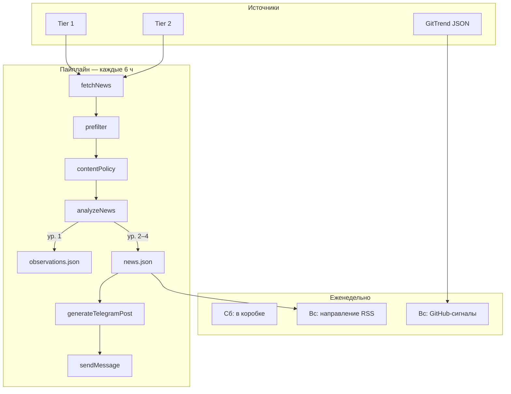
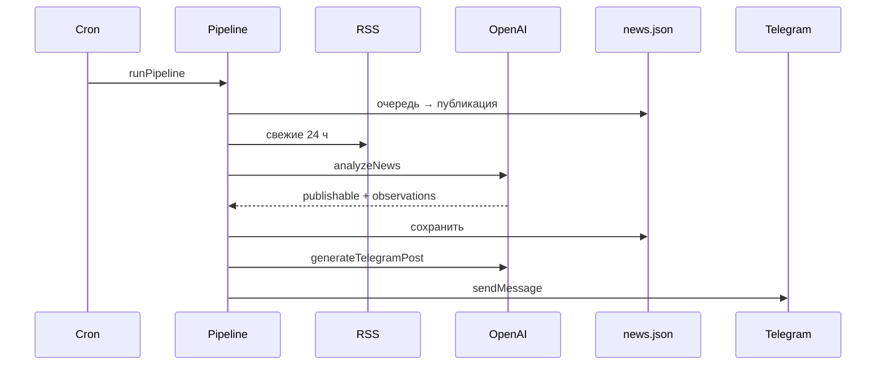

# Радар будущего

> [!summary] Суть
> Домашний бот для Telegram-канала **«Радар будущего»** — система раннего обнаружения технологических изменений. RSS → OpenAI → канал. Плюс еженедельные рубрики (RSS-тренды, GitHub-сигналы, гаджеты). Управление: веб-панель + команды в личке бота.

**Не новостной агрегатор.** Приоритет: первоисточники, внедрения, слабые сигналы — не количество заголовков.

---

## Быстрые ссылки

| Что | Где |
| --- | --- |
| Код | `D:\radar` |
| README | [[README]] → `README.md` |
| ТЗ GitTrend | `RADAR-FUTURE-INTEGRATION-TZ.md` |
| Настройки | `data/settings.json` |
| Очередь | `data/news.json` |
| Наблюдения (ур. 1) | `data/observations.json` |
| История канала | `data/published.json` |
| State GitHub-рубрики | `data/gittrend.json` |
| Состояние бота | `data/state.json` |
| Панель | `http://<IP-ПК>:3847` |
| GitTrend JSON | [weekly-radar.json](https://raw.githubusercontent.com/zobnin8-ux/gitrend/main/reports/weekly-radar.json) |
| Секреты | `.env` |

---

## Концепция канала

| Уровень | Название | Что происходит |
| --- | --- | --- |
| 1 | Наблюдение | Архив `observations.json`, **не** в канал |
| 2 | Сигнал | Публикуется |
| 3 | Влияние | Публикуется (+ возможен «Сигнал подтвердился») |
| 4 | Прорыв | Публикуется (+ возможен «Сигнал подтвердился») |
| — | Сбой системы | Публикуется |

### Формат поста

Текст + превью ссылки (HTML). Без обложек-радара.

```text
🔴 УРОВЕНЬ 3 — ВЛИЯНИЕ

Заголовок

Что произошло:
...

Почему это важно:
...

📡 Наблюдение:          ← если observerComment прошёл фильтр
...

📡 Сигнал подтвердился: ← impact/breakthrough + совпадение с архивом
...

Горизонт влияния: сейчас
Сферы: ...
Источник: ...
Ссылка: ...
```

> [!note] Наблюдатель
> Поле `observerComment` в `analyzeNews`. Фильтр `observerComment.ts` — не публикует банальное и повторы. Для старой очереди: `npm run backfill:observer`.

---

## Еженедельные рубрики

| UTC | МСК (~) | Рубрика | Команда | Файл |
| --- | --- | --- | --- | --- |
| Сб 10:00 | 13:00 | 📦 Будущее в коробке | `/box` | `runWeeklyInTheBox.ts` |
| Вс 11:00 | 14:00 | 🧭 Направление недели (RSS) | `/trends` | `runWeeklyTrends.ts` |
| Вс 11:30 | 14:30 | 🔮 GitHub-сигналы (GitTrend) | `/github` | `runWeeklyGitTrend.ts` |

> [!warning] Часовой пояс
> `node-cron` — **локальное время ПК**. В таблице МСК при UTC+3.

### GitHub-сигналы (GitTrend)

- **Датчик:** [gitrend](https://github.com/zobnin8-ux/gitrend) — `reports/weekly-radar.json`
- **Радар:** fetch → validate → select → `enrichGitTrend` → пост
- 0–3 тренда/неделю, не дневной лимит
- Первый пост — анонс рубрики (`src/content/gitTrendIntro.ts`)
- Повтор недели: `/github force`

### Направление недели

Синтез 3 направлений из RSS-сигналов за 7 дней. Отдельно от GitHub.

### Будущее в коробке

Гаджеты с **технологией внутри**, не обзоры корпуса. Отдельные RSS.

---

## Архитектура



### OpenAI-вызовы

| Этап | Файл | Когда |
| --- | --- | --- |
| Анализ RSS | `analyzeNews.ts` | Батч до 20 новостей |
| Текст поста | `generateTelegramPost.ts` | Каждая публикация |
| Сигнал подтвердился | `generateSignalConfirmed.ts` | При совпадении с архивом |
| Направление недели | `generateWeeklyTrends.ts` | Воскресенье |
| GitHub enrich | `enrichGitTrend.ts` | Воскресенье |
| Гаджет | `analyzeGadget.ts`, `generateInTheBoxPost.ts` | Суббота |
| Backfill наблюдателя | `backfillObserver.ts` | Вручную |

---

## Пайплайн публикации

- **Очередь** — `news.json`, записи без `postedAt`, уровни 2–4 + failure
- **Квота категорий** — `categoryQuotaMax` (4/день)
- **Микс горизонтов** — `horizonMixPercent` (30%)
- **Минимум AI** — `minAiPostsPerDay` (1)
- **Инъекция** — `/inject N`, вне лимита, `postType: injection`
- **Вес** — `уровень + score × trust × горизонт`
- **RU-лимит** — не более 2 постов/день из `region: ru`



---

## Источники RSS (32 шт.)

### Tier 1 (`trust = 1.0`)

AI: OpenAI, Anthropic, DeepMind, Google AI/Research, Meta AI, Microsoft AI, Mistral, xAI, Cohere · Космос: NASA, ESA · Наука: Nature, MIT, Stanford, Berkeley, arXiv.

### Tier 2 (`trust = 0.7–0.85`)

TechCrunch, The Verge, Ars Technica, MIT TR, IEEE Spectrum, New Atlas, Interesting Engineering, SpaceNews, Electrek.

### Российские — дополнительный контур (`region: ru`, `language: ru`)

> [!important] Не основная повестка
> Лимит **2 поста в день** из RU (`MAX_RU_POSTS_PER_DAY`). Те же content firewall и фильтры, что для всего мира.

| Приоритет | Источник | trust | Примечание |
| --- | --- | ---: | --- |
| Высокий | N+1 | 0.85 | Космос, AI, наука, инженерия |
| Средний | 3DNews | 0.75 | Железо, гаджеты; также «Будущее в коробке» |
| Средний | Naked Science | 0.75 | Hi-Tech + Science; без рубрики `/tech/` (оружие) |
| Тестовый | Хайтек | 0.60 | Оценка качества |

**Исключены после RSS-теста:** Хабр, CNews, TAdviser, Indicator.ru, Элементы, Наука.рф, общеновостные СМИ.

**Язык:** `language: ru` → без перевода (заголовок, описание, AI, пост — по-русски).

**Проверка лент:** `/rutest` или `npm run test:ru-sources` (без AI, отчёт в личку).

> [!tip] Зеркала
> Anthropic, Meta, Mistral, xAI, Cohere — [Olshansk/rss-feeds](https://github.com/Olshansk/rss-feeds).

### Content firewall

`src/filters/contentPolicy.ts` — до OpenAI, после AI, перед публикацией. Политика, военка, санкции, dual-use без гражданского контекста.

---

## Настройки

### `data/settings.json` (текущие)

| Параметр | Значение |
| --- | --- |
| `maxPostsPerDay` | 15 |
| `maxPostsPerRun` | 3 |
| `postIntervalCron` | `0 */6 * * *` |
| `categoryQuotaMax` | 4 |
| `horizonMixPercent` | 30 |
| `minAiPostsPerDay` | 1 |

### `.env` — рубрики и GitTrend

```env
WEEKLY_TRENDS_CRON=0 11 * * 0
WEEKLY_GITTREND_CRON=30 11 * * 0
WEEKLY_IN_THE_BOX_CRON=0 10 * * 6
GITTREND_RADAR_URL=https://raw.githubusercontent.com/zobnin8-ux/gitrend/main/reports/weekly-radar.json
GITTREND_MAX_POSTS=3
GITTREND_MIN_SIGNAL_STRENGTH=medium
GITTREND_CATEGORY_COOLDOWN_DAYS=14
```

---

## Структура кода

```text
src/
├── pipeline/
│   ├── runPipeline.ts
│   ├── runWeeklyTrends.ts      # RSS направление
│   ├── runWeeklyGitTrend.ts    # GitHub-сигналы
│   ├── runWeeklyInTheBox.ts    # гаджеты
│   ├── runQueueInjection.ts
│   └── scheduler.ts
├── gittrend/                   # fetch, validate, select
├── ai/
│   ├── analyzeNews.ts
│   ├── generateTelegramPost.ts
│   ├── generateSignalConfirmed.ts
│   ├── enrichGitTrend.ts
│   ├── buildGitTrendPost.ts
│   ├── backfillObserver.ts
│   └── generateWeeklyTrends.ts
├── content/gitTrendIntro.ts
├── storage/
│   ├── newsStore.ts
│   ├── observationsStore.ts
│   ├── gitTrendStore.ts
│   ├── inTheBoxStore.ts
│   └── trendsStore.ts
└── utils/
    ├── observerComment.ts
    └── observationMatch.ts
```

---

## Команды

### npm

| Команда | Действие |
| --- | --- |
| `npm start` | Запуск |
| `npm run build` | Сборка |
| `npm run backfill:observer` | Наблюдатель в очередь |
| `npm run test:ru-sources` | Тест RU RSS → Telegram |
| `npm run desktop` | Ярлык |

### Telegram

| Команда | Действие |
| --- | --- |
| `/run` | Пайплайн |
| `/dry` | Тест без канала |
| `/rutest` | Тест RU RSS (4 источника) |
| `/inject 5` | Инъекция из очереди |
| `/trends` | Направление недели |
| `/github` | GitHub-сигналы |
| `/github force` | Повтор недели |
| `/box` | Будущее в коробке |
| `/pause` / `/resume` | Пауза |
| `/status` / `/today` / `/panel` | Статус |

---

## Данные

### `news.json`

Очередь публикации. Поля: `level`, `score`, `category`, `impactHorizon`, `reason`, `observerComment`, `technology`, `postedAt`.

### `observations.json`

Архив уровня 1. Миграция из `news.json` при старте пайплайна.

### `published.json`

`postType`: `article` | `trends` | `github-trends` | `in-the-box` | `injection`

### `gittrend.json`

Обработанные недели и опубликованные GitHub-тренды.

---

## Типичная неделя

1. Пн–пт, вс: пайплайн каждые 6 ч
2. **Суббота ~13:00 МСК:** «Будущее в коробке»
3. **Воскресенье ~14:00 МСК:** «Направление недели»
4. **Воскресенье ~14:30 МСК:** «GitHub-сигналы»
5. Вручную: `/inject`, `/run`

> [!important] Uptime
> Cron работает только пока запущен `npm start` и ПК не спит.

---

## История решений

| Дата | Решение |
| --- | --- |
| 2026-06 | Убраны обложки → текст + превью |
| 2026-06 | Наблюдатель `observerComment` + backfill |
| 2026-06 | Наблюдения уровня 1 → `observations.json`, дайджест удалён |
| 2026-06 | «Сигнал подтвердился» для impact/breakthrough |
| 2026-06 | Инъекция `/inject`, квоты, микс горизонтов |
| 2026-06 | Рубрика «Будущее в коробке» |
| 2026-06 | Две воскресные рубрики: RSS-тренды + GitTrend |
| 2026-06 | Анонс GitHub-рубрики в первом посте |

---

## Связанные заметки

- [[README]]
- `RADAR-FUTURE-INTEGRATION-TZ.md`

---

## Заметки для себя

- 
